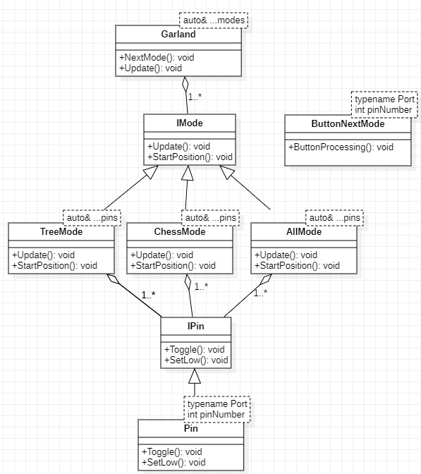

:toc: macro 

include::Title.adoc[lines=1..8]

[.text-center]
Отчет по лабораторной работе №7 +
на тему "Создание гирлянды"

include::Title.adoc[lines=12..24]

== Оглавление

toc::[]

== Введение

Цель: создание гирлянды с тремя режимами и переключения их с помощью кнопки. 

== UML диаграмма

.UML диаграмма программы работы гирлянды

== PIN и IPin

В классе Pin две функции Toggle и SetLow. Toggle отвечает за смену бита в регистре на противоположный. SetLow отвечает за сброс бита в регистре. Класс Pin наследует интерфейсный класс IPin.

Класс Pin

.pin.h
[source, cpp]
----
#ifndef PIN
#define PIN

#include "ipin.h"
#include "gpioaregisters.hpp" // for GPIOA

template<typename Port, int pinNumber>
class Pin : public IPin
{
public:
  void Toggle() const override
  {
    Port::ODR::Toggle(1<<pinNumber);
  }
  void SetLow() const override
  {
    Port::ODR::Write(Port::ODR::Get() & ~(1 << pinNumber));
  }
};
#endif
----

Класс IPin

.ipin.h
[source, cpp]
----
#ifndef IPIN
#define IPIN

class IPin
{
  public:
  virtual void Toggle() const = 0;
  virtual void SetLow() const = 0;
};

#endif
----

== Классы отвечающие за режимы и интерфесный класс IMode

Всего в программе 3 режима: ChessMode, AllMode и TreeMode. 

В режиме ChessMode светодиоды зажигаются в шахматном порядке, сначала зажигается 1 и 3 светодиод, через секунду 1 и 3 гаснут, а 2 и 4 зажигаются, еще через одну секунду 2 и 4 гаснут, а 1 и 3 загараются и так по кругу.

В режиме AllMode все светодиоды мигают раз в секунду.

В режиме TreeMode светодиоды зажигаются в виде елочки, т.е. загарается 1 светодиод, через секунду 2, за ним 3 и 4, в том же порядке они гаснут.

Все три класса наследуют один интерфейсный класс IMode.

.chessmode.h
[source, cpp]
----

#ifndef CHESSMODE
#define CHESSMODE

#include "imode.h"
#include <array>

template<auto& ...pins>
class ChessMode : public IMode
{
public:
  void Update() override
  {
    for(int LEDposition=0; LEDposition<leds.size(); ++LEDposition)
    {
      leds[LEDposition]->Toggle();
    }
  }
  void StartPosition() override
  {
    for(auto it: leds)
    {
        it->SetLow();
    }
    for(int LEDposition=0; LEDposition<leds.size(); LEDposition+=2)
    {
      leds[LEDposition]->Toggle();
    }
  }
private:
  std::size_t LEDposition=0;
  std::array<IPin*, sizeof ...(pins)> leds = {static_cast<IPin*> (&pins)...};
};

#endif
----

.allmode.h
[source, cpp]
----

#ifndef ALLMODE
#define ALLMODE

#include "imode.h"
#include <array>

template<auto& ...pins>
class AllMode : public IMode
{
public:
  void Update() override
  {
    for(int LEDposition=0; LEDposition<leds.size(); ++LEDposition)
        {
            leds[LEDposition]->Toggle();
        }
  }
  void StartPosition() override
  {
      LEDposition =0;
      for(auto it: leds)
      {
          it->SetLow();
      }
  }
private:
  std::size_t LEDposition=0;
  std::array<IPin*, sizeof ...(pins)> leds = {static_cast<IPin*> (&pins)...};
};

#endif

----

.treemode.h
[source, cpp]
----

#ifndef TREEMODE
#define TREEMODE

#include "imode.h"
#include <array>

template<auto& ...pins>
class TreeMode : public IMode
{
public:
  void Update() override
  {
    leds[LEDposition++]->Toggle();
    if(LEDposition== leds.size())
    {
      LEDposition=0;
    }
  }
  void StartPosition() override
  {
      LEDposition=0;
     for(auto it: leds)
      {
          it->SetLow();
      }
  }
private:
  std::size_t LEDposition=0;
  std::array<IPin*, sizeof ...(pins)> leds = {static_cast<IPin*> (&pins)...};
};

#endif

----

.imode.h
[source, cpp]
----

#ifndef IMODE
#define IMODE

class IMode
{
  public:
  virtual void Update() = 0;
  virtual void StartPosition() = 0;
};

#endif

----

=== Класс Garland 

В классе Garland описываются две функции NextMode и Update. Функция NextMode переключает режимы. Функция Update запускает выбранный режим в функции NextMode. 

.garland.h
[source, cpp]
----

#ifndef GARLAND
#define GARLAND

#include <array>

template<auto& ...modes>
class Garland 
{
public:
  void NextMode() 
  {
    i++;
    if(i== regime.size()) 
    {
      i=0;
    }
    currentMode = regime[i];  
    currentMode->StartPosition(); 
    
    
  }
  void Update()
  {
    currentMode->Update();
  }
private:
  std::size_t i=0;
  std::array<IMode*, sizeof ...(modes)> regime = {static_cast<IMode*> (&modes)...};
  IMode* currentMode = regime[0]; 
};

#endif
----

=== Класс ButtonNextMode

В классе ButtonNextMode функция обработки кнопки ButtonProcessing. В этой функции объявлена переменная IsPressedButton, которая равна единицы в момент отжатия кнопки и нулю в остальное время.  

.buttonnextmode.h
[source, cpp]
----
#ifndef BUTTONNEXTMODE
#define BUTTONNEXTMODE

#include "gpioaregisters.hpp" // for GPIOA

template<typename Port, int pinNumber>
class ButtonNextMode
{
public:
  void ButtonProcessing() 
  {
    
    previouspositionbutton = buttonposition;
    buttonposition = ((Port::IDR::Get() & (1<<pinNumber)) != (1<<pinNumber));
    
    IsPressedButton = (previouspositionbutton and not buttonposition);
    
  }
  bool IsPressed() const
  {
    return IsPressedButton;
  }

  }
  std::size_t buttonposition;
  std::size_t previouspositionbutton;
  std::size_t IsPressedButton;
};

#endif
----

=== main

В main объявляется переменные pin1, pin2, pin3, pin4, типа класса Pin, отвечающие за определенные светодиоды.

Объявляется переменную treeMode, chessMode, allMode, отвечающие за режимы елочка, шахматный режим и мигания всех светодиодов.

Объявляется переменная garland типа класса Garland, в класс передаются режимы в следующем порядке: treeMode, chessMode, allMode.

В цикле for, в начале вызывается функция обработки кнопки ButtonProcessing(). В момент отжатия кнопки, т.е. когда IsPressedButton равна единицы, вызывается функция NextMode(), режим переключается в соответствии порядка garland. После вызывается функция Update(), которая запускает выбранный режим.

.main.cpp
[source, cpp]
----

#include "rccregisters.hpp" // for RCC
#include "gpioaregisters.hpp" // for GPIOA
#include "gpiocregisters.hpp" // for GPIOС
#include  "pin.h"
#include  "treemode.h"
#include  "chessmode.h"
#include  "basemode.h"
#include  "allmode.h"
#include  "garland.h"
#include  "buttonnextmode.h"
#include <iostream>

std::uint32_t SystemCoreClock = 16'000'000U;
void delay(int cycles)
{
  for(int i = 0; i < cycles; ++i)    
  {   
    asm volatile("");
  }    
}

Pin<GPIOA, 5> pin1;
Pin<GPIOC, 9> pin2;
Pin<GPIOC, 8> pin3;
Pin<GPIOC, 5> pin4;

BaseMode<pin1, pin2, pin3, pin4> baseMode;
TreeMode<pin1, pin2, pin3, pin4> treeMode; 
ChessMode<pin1, pin2, pin3, pin4> chessMode;
AllMode<pin1, pin2, pin3, pin4> allMode;
Garland<treeMode, chessMode, allMode> garland;

ButtonNextMode<GPIOC, 13> button;

int main()
{  
  //Подать тактирование на порт А
  RCC::AHB1ENR::GPIOAEN::Enable::Set() ;
  //Подать тактирование на порт С
  RCC::AHB1ENR::GPIOCEN::Enable::Set() ;
  //Порта А.5 на вывод
  GPIOA::MODER::MODER5::Output::Set() ;
  //Порта C.5,C.8, C.9 на вывод
  GPIOC::MODER::MODER5::Output::Set() ;
  GPIOC::MODER::MODER8::Output::Set() ;
  GPIOC::MODER::MODER9::Output::Set() ;
  //Порт С.13 на ввод
  GPIOC::MODER::MODER13::Input::Set() ;
  

  
  for(;;)
  {
     
     button.ButtonProcessing();
     if(button.IsPressedButton == true)
     {
        garland.NextMode();
      
     } 
     garland.Update();
     
     delay(1000000);
  }
  
  return 1;
}

----

== Заключение 

В результате получили гирлянду с тремя режимами, ChessMode, AllMode и TreeMode, переключения между ними с помощью кнопки.

.Работа гирлянды
video::Работа гирлянды.mp4[]