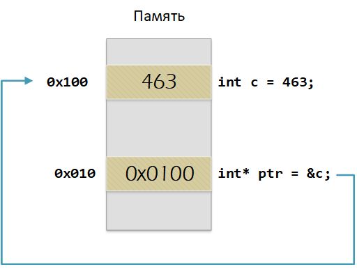
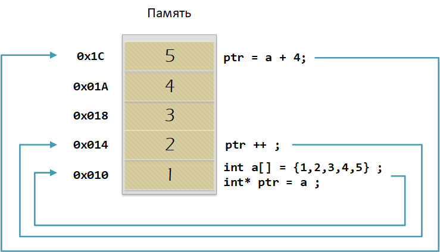

:toc: macro 

include::Title3.adoc[lines=1..8]

[.text-center]
Отчет по лабораторной работе №3 +
на тему "Указатели, ссылки и адреса"

include::Title3.adoc[lines=12..24]

== Оглавление

toc::[]

== Введение

Цель: Разобрать указатели, ссылки и адреса, описать новые знания полученные из лекции 2.

Каждой переменной содержащей данные соответствует некий адрес памяти. К переменной можно обратиться непосредственно обращаясь к самой переменной, тогда мы можем напрямую писать или читать значение с адреса переменной, либо можно обратиться косвенно, через указатель или ссылку.

== Указатель

Указатель это переменная, которая хранит адрес другой переменной. Пример:

.main.cpp
[source, cpp]
----
int main() {
  int  c = 463 ;   # (1)
  int* ptr = &c ;  # (2)
  return 0;
}
----

. Объявляем переменную c типа int
. Объявляем указатель ptr на переменную c типа int. 

.Значение переменной и указателя на переменную в памяти

Оператор & позволяет взять значение адреса переменной. 

Для разыменования указателя нужно записать в указатель любое число.

Пример разыменования указателя:

.main.cpp
[source, cpp]
----
  int  c = 463 ;   # (1)
  int* ptr = &c ;  # (2)
  *ptr = 453;
----

Указатель можно складывать, вычитать, сравнивать с целым числом. Также указатели можно вычитать и сравнивать между собой, разность нужна например для того чтобы найти количество байт между указателями. Можно и складывать указатели, но это бессмыслено, т.е. нет задач для этого. При этом указатеи и числа должны быть одного типа. Т.е. не нужно например складывать укатель типа char * и int *.

=== Сложение указателей

Разберем пример сложения указателя с целым числом:

.main.cpp
[source, cpp]
----
int main() {
  int  arr[] = {1,2,3,4,5} ;    # (1)
  int* ptr = arr ;              # (2)

  ptr ++ ;                      # (3)
  int a = *(ptr + 3) ;          # (4)
}
----

. Объявляем массив arr из 5 элементов. В целом можно считать, что массив arr это указатель на первый элемент массива.

. Обявления указателя на массив типа int ;

. Увеличиваем указатель на 1. На самом деле мы смещаемся по адресам на размер равный size_of(int), т.е. на 4 байта. Т.е в данном случае указатель ptr стал указывать на элемент массива arr[1].

. Записываем в переменную а типа int данные, находящиеся по адресу, хранящиеся в указателе ptr, смещенном на 3.

.Процесс сложения указателей

=== Константный указатель и указатель на константу

Использовать указатель нужно осторожно, т.к. во многих случаях неправильное его использование может являтся причинной ошибки программы.

Для избежания ошибки при использовании указателя вводят модификаторы доступа.

Примером такого модификатора является константный указатель.

.main.cpp
[source, cpp]
----
int main() {
  const auto pi[] = {3.14, 3.14159};# (1)
  const double *ptr = pi ;          # (2)
  *ptr = 3.14159 ;                  # (3)
  ptr++ ;                           # (4)
  count << *ptr ;                   # (5)
  const double * const ptr1 = pi ;  # (6)
  ptr1++  ;                         # (7)
  retrun 0 ;
}
----

. Объявим константный массив, который не может менятся.
. Указатель на константу будет хранить адрес переменной.
. Так как массив константный операция разыменования не будет работать.
Увеличиваем указатель на 1 (теперь указатель указывает на p[1]).
. Вывод значения по указателю (3.14159)
. Объявляем константный указатель на константу
. Нельзя изменить указатель, он константный.

== Ссылка

Ссылка это псевдоним переменной. Для определения ссылки применяется знак амперсанда &.

У ссылки нельзя взять адрес, адрес существует, но при применении оператора взятия адреса к ней, то будет выведен адрес переменной, на которую она ссылается.

Ссылка ведет себя почти также как константный указатель. Её нельзя изменять, складывать, вычитать

Ссылки нельзя сравнивать

Ссылка не может быть не проинициализирована.

Рассмотрим пример использования ссылки:

.main.cpp
[source, cpp]
----
int main(){
  int a = 0;
  int &ref = a;                # (1)
  ref = 10;                     # (2)
  return 0 ;
}
----

. Объявляем ссылку ref на переменную а.
. Присваивая какое то число к ссылке на переменную, число будет присвоено к самой пременной.

== Вывод

Изучены что такое ссылки, указатели и адреса. Они нужны для того чтобы не передавать большие массивы данных в функции, которые с ними работают.